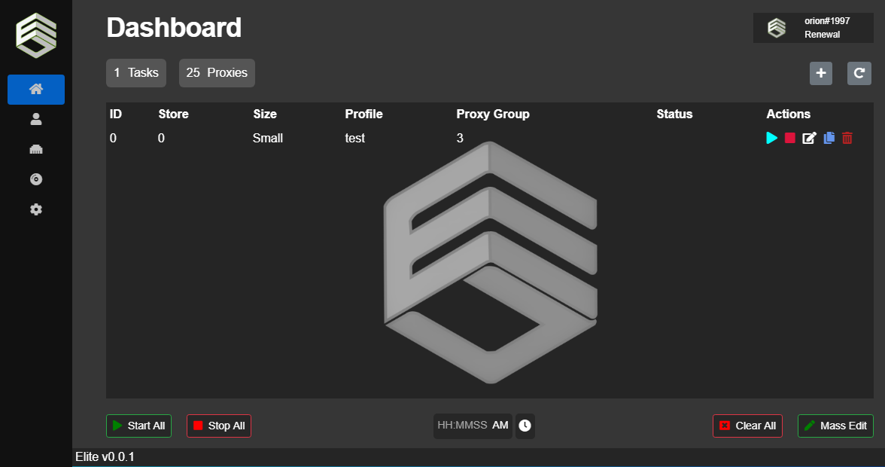

<br>

<p>
  Electron React Application uses <a href="https://github.com/electron-react-boilerplate/electron-react-boilerplate">Electron React Boilerplate</a>, <a href="https://facebook.github.io/react/">React</a>.
</p>

<br>

<div align="center">



</div>

## Install

- **If you have installation or compilation issues with this project, please see [our debugging guide](https://github.com/electron-react-boilerplate/electron-react-boilerplate/issues/400)**

First, clone the repo via git and install dependencies:

```bash
git clone https://github.com/smileguitar/ElectronReactApplication.git your-project-name
cd your-project-name
yarn
```

## Starting Development

Start the app in the `dev` environment. This starts the renderer process in [**hot-module-replacement**](https://webpack.js.org/guides/hmr-react/) mode and starts a webpack dev server that sends hot updates to the renderer process:

```bash
yarn dev
```

## Packaging for Production

To package apps for the local platform:

```bash
yarn package
```
